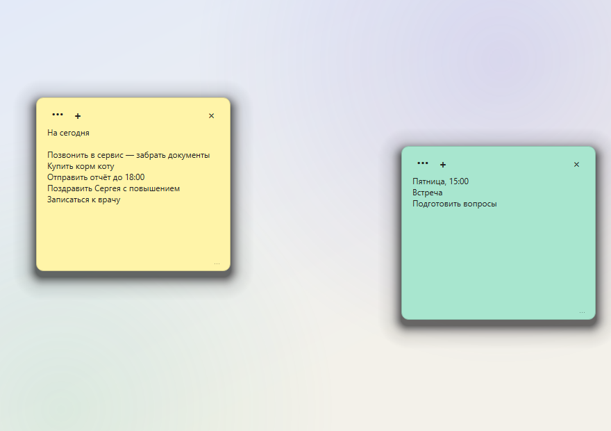

# Stickio

Заметки-стикеры на рабочем столе Windows. Нажали `Ctrl+Shift+N` — стикер уже
на экране, поверх всех окон, можно писать, не переключаясь из текущей программы.



Бесплатно, без регистрации, рекламы и облака. **Программа не делает ни одного
сетевого запроса** — это можно проверить поиском по исходникам, а не принимать
на веру.

## Скачать

- **Сайт:** <https://stickio.tumioai.ru>
- **Установщик:** [Stickio_Setup_1.1.0.exe](https://stickio.tumioai.ru/downloads/Stickio_Setup_1.1.0.exe) — 33,4 МБ

```
SHA-256  c4067e9bedd5a8e733cfda8b195e0e74ce2ab221f493a1a5ef2a7919cf773203
```

Windows 10 и 11, 64-бит. Около 130 МБ на диске, интернет не нужен.
Права администратора не обязательны: можно установить только для текущего
пользователя.

> **Установщик не подписан цифровым сертификатом**, поэтому SmartScreen может
> показать «Windows защитила ваш компьютер» с пометкой о неизвестном издателе.
> Нажмите «Подробнее» → «Выполнить в любом случае». Подпись стоит денег,
> а программа бесплатная. Скачанный файл можно сверить по хэшу выше.

## Что умеет

- **Новая заметка за секунду** — `Ctrl+Shift+N` работает из любой программы.
- **Поверх всех окон** — заметка не прячется за браузером или редактором.
- **Свой вид у каждой заметки** — 12 цветов фона, 12 цветов текста, плюс любой
  свой цвет; размер шрифта и ширина задаются отдельно.
- **Поиск по всем заметкам** — `Ctrl+Shift+F`, с подсветкой совпадений
  и поддержкой регулярных выражений.
- **Автосохранение** — текст записывается сам, пока вы печатаете.
- **Свернуть всё разом** — `Ctrl+Shift+H` убирает стикеры с экрана и возвращает
  обратно.
- **Экспорт и перенос** — все заметки выгружаются в JSON или HTML, базу можно
  скопировать на другой компьютер.
- **Живёт в трее** и умеет запускаться вместе с Windows.
- **Русский и английский** — язык переключается в настройках и применяется
  сразу, без перезапуска.
- Сочетания клавиш меняются в настройках.

## Где лежат заметки

| Запуск | База | Логи |
|---|---|---|
| Установленная программа | `%LOCALAPPDATA%\Stickio\notes.db` | `%LOCALAPPDATA%\Stickio\logs` |
| Из исходников | `<проект>\data\notes.db` | `<проект>\logs` |

Это **разные файлы**. Запустив исходники, легко решить, что записи пропали, —
на самом деле у них своя база. Рядом с базой программа держит автокопии
(`notes.db.bak.1`, `.bak.2`, …).

Удаление программы не удаляет заметки: база лежит в профиле пользователя
и остаётся на месте.

## Приватность

- Нет ни одного сетевого вызова: ни проверки обновлений, ни телеметрии,
  ни аналитики. Проверяется по коду:

  ```
  git grep -n "import socket\|import urllib\|import requests\|QNetwork"
  ```

- Заметки хранятся в локальном файле SQLite и никуда не отправляются.
- Учётной записи нет, интернет программе не нужен.

## Сборка из исходников

Нужен Python 3.11 (в системном Python 3.13 PySide6 может быть не установлен).

```bash
pip install -r requirements-dev.txt   # PySide6, PyInstaller, Pillow
python main.py                        # запуск из исходников
```

Сборка exe и установщика — одной командой:

```bash
build.bat
```

Результат: `dist\Stickio\Stickio.exe` и `dist\Stickio_Setup_<версия>.exe`.
Нужен установленный [Inno Setup 6](https://jrsoftware.org/isdl.php). Версия
задаётся в одном месте — `set APP_VERSION` в начале `build.bat` — и сверяется
с `version_info.txt`.

Сборка идёт **в папочном режиме (`onedir`), а не одним exe**. Это осознанно:
в режиме `--onefile` загрузчик распаковывает Python во временную папку
и запускает код оттуда, а для поведенческой эвристики антивирусов это типовая
картина упакованного вредоносного файла. Именно на такую сборку срабатывал
Kaspersky.

## Тесты

```bash
PYTHONPATH=. python -m unittest discover -s tests
```

306 тестов, около трёх секунд. `PYTHONPATH` обязателен: без него не находятся
пакеты `services`, `widgets` и остальные.

Тесты перевода сверяют словарь с исходниками в обе стороны: у каждой русской
строки должен быть английский перевод, и у каждого перевода — строка в коде.
Кроме этого английский интерфейс обходится по живому дереву виджетов — так
ловится подпись, которая не прошла через `tr()` и осталась русской.

Отдельные тесты рендерят окна Qt, поэтому запускать их лучше на обычном рабочем
столе, а не в безоконной среде.

## Структура проекта

| Что | Где |
|---|---|
| Точка входа, трей, диалог настроек | `app.py`, `main.py` |
| Окно заметки, ресайз, меню редактора | `widgets/sticky_note.py` |
| Панель инструментов | `widgets/toolbar.py` |
| Палитры фона и текста | `widgets/color_picker.py` |
| Окно поиска | `widgets/search_window.py` |
| Захват сочетания клавиш | `widgets/hotkey_edit.py` |
| Глобальные сочетания (Win32) | `services/hotkeys.py` |
| Настройки | `services/settings.py` |
| Перевод интерфейса, словарь | `services/i18n.py` |
| Видимость, каскад, счётчик | `services/note_manager.py` |
| Поиск по заметкам | `services/search.py` |
| Экспорт, импорт, копия базы | `services/transfer.py` |
| Сведения об авторе и версии | `services/app_info.py` |
| База данных и миграции | `database/database.py` |
| Модель заметки | `models/note.py` |
| Метаданные exe | `version_info.txt` |
| Инсталлятор | `installer/ModernStickyNotes.iss` |
| Сайт | `site/` |
| Сборка картинок для сайта и промо | `tools/` |

## История изменений

Что менялось от версии к версии — в [CHANGELOG.md](CHANGELOG.md).

## Лицензия

MIT — см. [LICENSE](LICENSE). Коротко: код можно свободно использовать,
менять и распространять, в том числе в своих проектах, при условии сохранения
текста лицензии и указания авторства. Гарантий никаких.

---

## English

**Stickio** is a free sticky-notes app for the Windows desktop: notes stay on
top of other windows, `Ctrl+Shift+N` creates one from anywhere, `Ctrl+Shift+F`
searches across all notes, `Ctrl+Shift+H` hides them all. Autosave, per-note
colour, font size and width, export to JSON/HTML, tray icon, run at startup.

No account, no ads, no telemetry, **no network requests at all** — verifiable
by searching the source. Notes live in a local SQLite file
(`%LOCALAPPDATA%\Stickio\notes.db`).

The interface comes in **Russian and English**; switch it in the settings, no
restart needed.

- Website: <https://stickio.tumioai.ru>
- Installer: [Stickio_Setup_1.1.0.exe](https://stickio.tumioai.ru/downloads/Stickio_Setup_1.1.0.exe) (33.4 MB, Windows 10/11 64-bit)
- The installer is unsigned, so SmartScreen may warn about an unknown publisher.

Built with Python 3.11 and PySide6 (Qt 6), SQLite. Licensed under the
[MIT License](LICENSE).
